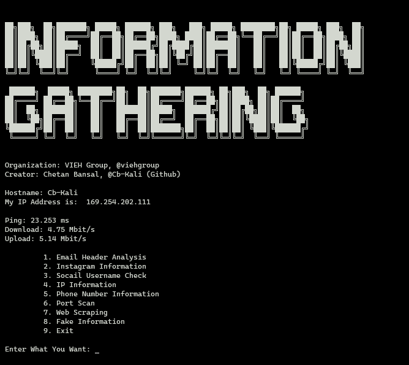

# **Information-Gathering**

### Project Idea Briefing

- The primary benefit of ethical hacking is to prevent data from being stolen and misused by malicious attackers, as well as: Discovering vulnerabilities, Scanning network. In this cyber security domain, there are various types of tools are available but day by days security issues and our technology are updated. We are creating some tools like port scanner, network scanner, mac address changer, and some others tools. A hacking tool is a program designed to assist a hacker with hacking.

- These tool use by any company or any individuals person for collect information, scan port, fuzzing, and some more thing.

### Project Working 

- I use Command line interface for project. This project for beginner and help those people they gather information about Email Header Analysis, Instagram Information, Instagram Username Check, Ip Information, Phone Number Information, Port Scan, Web scraping, give fake information. This tool shows your hostname and public IP first and check your internet speed, then user give input and according to option this tool work.

### Follow us on my social networks:

Organization:
1. LinkedIn: https://in.linkedin.com/company/viehgroup

2. Twitter: https://twitter.com/viehgroup

3. GitHub: https://github.com/viehgroup

4. Instagram: https://www.instagram.com/viehgroup

Developer:
1. LinkedIn: https://in.linkedin.com/in/chetanbansal11

2. Twitter: https://twitter.com/cbkali7838

3. GitHub: https://github.com/cb-kali/ 

4. Instagram: https://www.instagram.com/i.m.cbkali/

